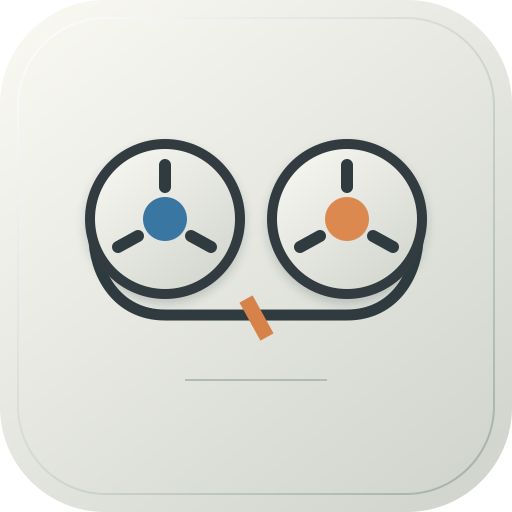

# Mana Tape

**Моделі, резерви й підписки — на одному пульті.**

Українська панель для налаштування моделей, резервних ланцюжків і підписок [Oh My Pi (OMP)](https://github.com/can1357/oh-my-pi). Кожна роль — монтажна доріжка, кожен маршрут до моделі — CUT. Панель працює на Linux і macOS, локально або через приватне SSH-підключення.

Mana Tape — самостійний проєкт. Він підключається до зовнішніх OMP-проєктів через локальну конфігурацію. Код, назви ролей, ключі та налаштування конкретного користувача не потрібно додавати до репозиторію.



*Один прилад: LCD показують ресурс, CUTS складаються в доріжки, ручки налаштовують дисплеї.*

## Можливості

- Кілька OMP-проєктів із перемиканням у панелі. Окремі профілі, чернетки, резервні копії та FREE-пули для кожного проєкту.
- Довільні ролі з `modelRoles` і агенти з `task.agentModelOverrides`; успадкування профілів зі Standard.
- Основні моделі, резерви та thinking. Перетягування між доріжками копіює CUT; у межах доріжки змінює порядок. Є керування клавіатурою й дотиком.
- FREE GOOD / FREE FAST: спільні колекції для всіх профілів одного проєкту. Редагування в одному місці оновлює всі їхні використання.
- Undo/Redo, збереження чернеток у вкладці, перевірка конфліктів, резервні копії та відновлення.
- Каталог провайдерів, підтверджені FREE-маршрути, реальні доступні ліміти й статистика OMP. Невідома ціна не означає FREE.
- Необов’язкова заміна платного DeepSeek впорядкованими альтернативами; безкоштовний DeepSeek лишається.
- Світла/темна тема, мобільна панель, змінна висота CUTS.

Панель редагує конфігурацію для **майбутніх запусків OMP**. Вона не запускає й не перезапускає робочі сесії. Активні сесії зберігають власні налаштування.

## Швидкий старт

Потрібні Python 3.11+ та вже встановлений OMP. Node.js 22+ потрібен лише для тестів JavaScript. Адаптер перевірений з OMP 18.2.7; сумісність нових версій слід перевіряти тестами та деморежимом.

```sh
git clone https://github.com/bramms/ManaTape.git
cd ManaTape
python3 -m venv .venv
.venv/bin/pip install -r requirements.txt
mkdir -p ~/.config/mana-tape
cp examples/installation.yml ~/.config/mana-tape/installation.yml
```

Вкажіть у копії прикладу шлях до свого проєкту з `.omp/config.yml` і шлях до реєстру OMP. Запустіть:

```sh
.venv/bin/python server.py --config ~/.config/mana-tape/installation.yml
```

Відкрийте **http://127.0.0.1:19421/**. Поки репозиторій приватний, клонування потребує доступу GitHub. Для ознайомлення без OMP і без справжніх облікових записів: `make demo` → http://127.0.0.1:19424/. Насичений приклад, як на знімках: `make demo-showcase` на тому самому порту замість звичайної демонстрації.

## Документація

[Карта знань](docs/index.md) · [Вхід для AI-агентів](AGENTS.md) · [Підтримка проєкту](docs/MAINTENANCE.md)

- [Налаштування, кілька проєктів і власні ролі](docs/CONFIGURATION.md)
- [Щоденна робота](docs/USAGE.md)
- [Запуск, автозапуск, SSH, оновлення й відновлення](docs/OPERATIONS.md)
- [Архітектура та гарантії збереження](docs/ARCHITECTURE.md)
- [Джерела й межі оцінок моделей](docs/BENCHMARKS.md)
- [Правила інтерфейсу](docs/DESIGN.md)
- [Розробка та перевірки](CONTRIBUTING.md)
- [Безпека](SECURITY.md), [підготовка публічного випуску](docs/RELEASE.md)

## Необов’язкові інтеграції

[OpenCode Free](integrations/opencode-free/README.md) — локальний міст і розширення OMP для окремого провайдера `opencode-free`. Встановлюється та запускається окремо; панель працює без нього. Компонент потребує власного ключа користувача. Каталог і доступність моделей можуть змінюватися.

SSH-проксі може додатково передавати нормалізовані ліміти CommandCode із CodexBar на macOS. Це окрема опція, вимкнена за замовчуванням.

## Статус і ліцензування

Проєкт поширюється за [MIT-ліцензією](LICENSE). Включений компонент OpenCode Free зберігає власну [MIT-ліцензію](integrations/opencode-free/LICENSE). Репозиторій наразі приватний; відкриття для всіх — окреме рішення власника.

Це незалежний проєкт спільноти. Він не є офіційним продуктом OMP чи постачальників моделей.
